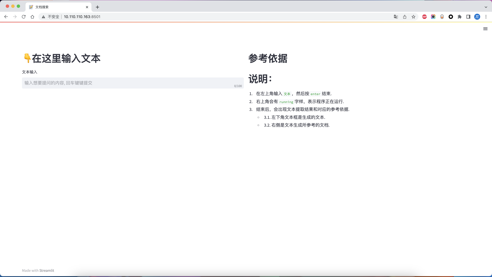
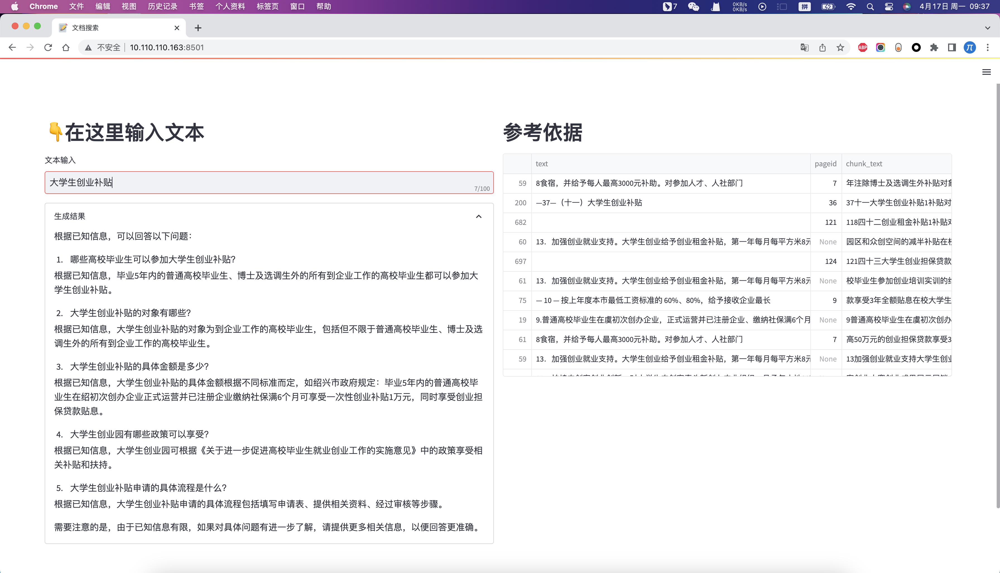

## 文档搜索
1. 🥱懒得用`langchain`，看他文档，可能需要一天，我自己实现的话，一天都不需要。
2. 💻 本质上就是`sbert`和`chatglm-6b`。
3. 👨‍💻 自己做一个得了。
4. 🗑️目前还是毛坯，后面继续更新。
5. 🎯只要传递一个文件夹📁，就可以把这个文件夹下所有的`.pdf`、`.docx`格式文件加载（目前还不支持的`.doc`格式文件)


## 用法

### 命令行形式
1. `demo.py`文件里面

```python 

if __name__ == "__main__":
    global_dir = "政策归档文件" # 你自己的文件夹

    kl = KnowLedge(global_dir=global_dir)
    res, data = kl.search_result(question_str="大学生创业有什么补贴") # 你想问什么呢
    print(res)
    print(data)
```
### web端
1. 注意修改`code-21`行的代码`global_dir = "政策归档文件"`
```bash
streamlit run web_ui.py --server.fileWatcherType none
```




